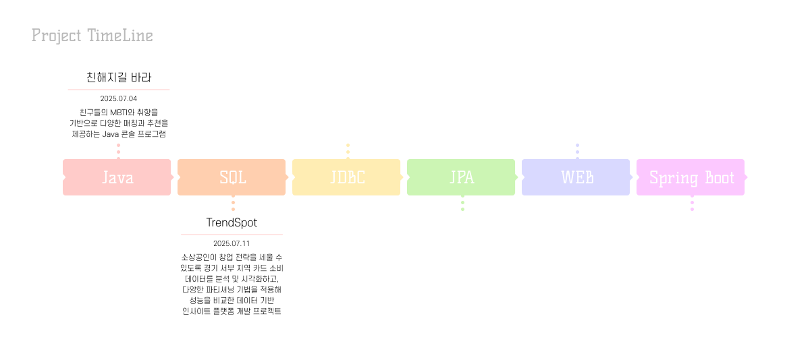

# 우리FISA 미니 프로젝트 모음
*최종 업데이트: 2025년 7월 18일*  

**우리FISA에서 진행한 미니 프로젝트들과 학습 내용을 모아놓은 레포지토리**입니다.😊

 

 

## 🌟 주요 프로젝트

| No | 프로젝트 이름                   | 설명                                         | 기술 스택                          | 링크                                      |
|----|------------------------------|--------------------------------------------|------------------------------------|-------------------------------------------|
| 1  | **친해지길 바라**          | 우리 반 친구들끼리 더 친숙해지고, 서로에 대해 알아가며 협력할 수 있는 Java Console 애플리케이션  |   | [GitHub 링크](https://github.com/LeeJoEun-01/FISA_1st_mini_Project)             |
| 2  | **TrendSpot**          | 소상공인이 창업 전략을 세울 수 있도록 경기 서부 지역 카드 소비 데이터를 분석·시각화하고, 다양한 파티셔닝 기법을 적용해 성능을 비교한 데이터 기반 인사이트 플랫폼 개발 프로젝트|           | [GitHub 링크](https://github.com/ChatHongPT/TrendSpot)             |
| 3  | **Plz Don't Go**       | Ubuntu 가상 머신에 ELK 스택을 구축하여 카드 소비 데이터를 실시간 분석하고 Life Stage별 이탈 가능성이 높은 고객을 시각화한 프로젝트 |        | [GitHub 링크](https://github.com/imewuzin/PlzDontGo) |
| 4  | **MoneyMoni**       | 금융감독원 공개 API 기반 예·적금 상품을 필터링·조회하고 즐겨찾기 기능을 제공하는 JSP 기반 금융상품 웹 서비스                                    |          | [GitHub 링크](https://github.com/imewuzin/MoneyMoni) |

 

### 📒 학습 내용
| No | 주제 | 링크|
|---|---|---|
|1|RDBMS SQL 문법 및 실습 |[ [Github 링크](https://github.com/imewuzin/FISA_mini_projects/blob/master/RDBMS%20SQL/README.md))
 

*이 레포지토리는 지속적으로 업데이트됩니다.*
